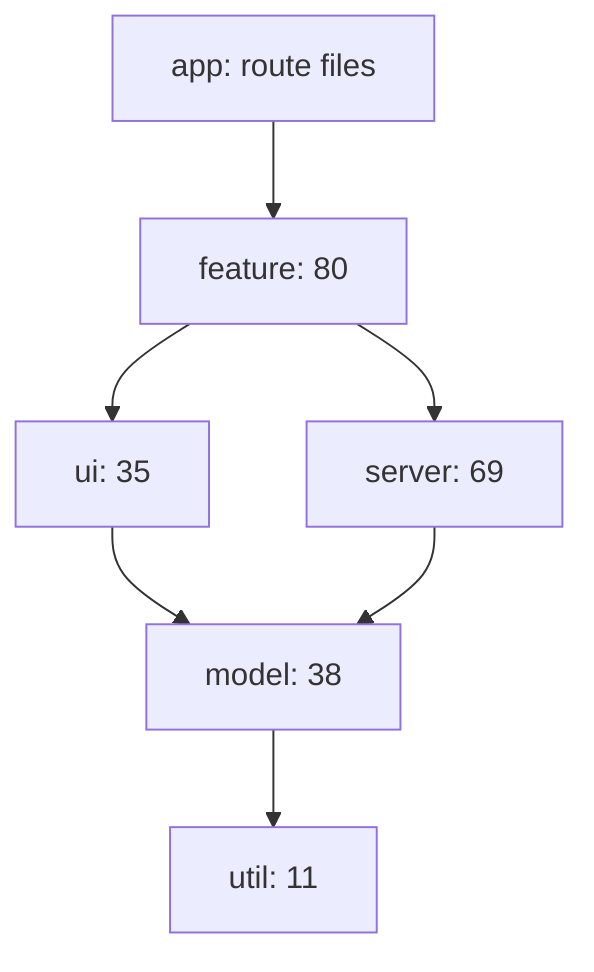
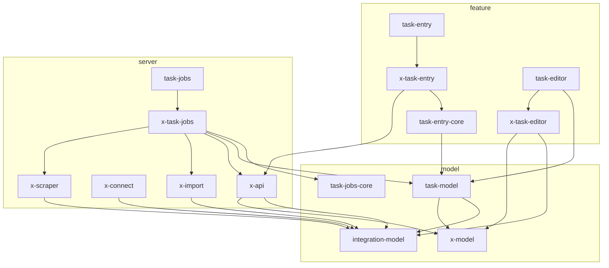

# Proposed package graph

This document proposes how to split giveaway.dog into a pnpm workspace that Nx manages. The split is fine-grained on purpose:

- **Server utilities and UI utilities:** each concern is its own package.
- **Feature areas:** each area has sub-packages.
- **Social platforms:** each platform is a set of small plugin packages.

[migration-plan.md](./migration-plan.md) describes how to get there.

The graph comes from the code, not from a whiteboard. A script read every import in the 1,154 source files and 961 test files at commit `57d8059` and assigned each file to a package. The result was [package-map.json](https://github.com/GGonryun/giveaway.dog/blob/f2ecbaf/docs/monorepo/package-map.json). A checker script compared the code with the map, and the move codemod in `tools/codemods` moved each package from it, until every package had moved. Then the map, the checker and the codemod were deleted; the last commit on `main` that has them is `f2ecbaf`. Now the ESLint rules in `@giveaway/eslint-config` enforce the graph (see Package types and dependency rules), and the generators in `tools/generators` create new packages.

## Summary

- **239 packages** in 20 groups, plus `apps/web`, `apps/web-e2e`, `tools/db-seed` and `tools/generators`.
- **No dependency cycles and no boundary violations**, after 8 small refactors ([R1 to R8](#refactors-that-make-the-graph-valid)). Mapped onto these packages as it is today, the code has 4 dependency cycles and 4 imports that break the type rules.
- **Small packages.** The median package has 3 source files, 4 internal dependencies and 2 npm dependencies. Today every CI job installs all 143 npm packages that the root `package.json` lists.
- **Small blast radius.** A change to one package affects a median of 8 packages and a mean of 25, out of 240. Today every change affects the whole app.
- **History replay.** The last 47 commits that changed code were replayed against the graph:
  - The median commit affects 39% of packages.
  - A quarter of the commits affect 4% or less.
  - 9 commits affect everything, because they changed the lockfile, the root `tsconfig.json` or the shared test setup.
- **Dead code.** 76 source files (6.6%) were dead. They and the 86 tests that tested only them are deleted ([#140](https://github.com/GGonryun/giveaway.dog/issues/140)), so nobody has to move them.

## Layout

```text
apps/
  web/                    Next.js routes only: page, layout, route and loading files
  web-e2e/                Playwright tests
packages/
  tooling/                tsconfig, eslint-config, vitest-config, testing-mocks, testing-server, testing-dom, testing-visual, testing-postgres, testing-integration, mutation-testing
  shared/                 util-*: helpers with no React and no server dependencies
  infra/                  db-*, cache, ratelimit, rpc-*, email, jobs, request-context-*, turnstile-*
  ui/                     ui-*: the design system, theme-*
  auth/  account/  team/  audience/  participants/
  tasks/  sweepstakes/  winners/  templates/  automation/
  pickers/  browse/  marketing/  shell/
  e2e/                    e2e-gate, e2e-model, e2e-server: the gate and the seed API of the end-to-end tests
  integrations/
    core/                 integration-model, integration-icons, integration-ui, integration-server, platform-catalog
    x/  bluesky/  discord/  twitch/  youtube/  steam/  meta/  tiktok/  linkedin/  kick/  velora/
tools/
  generators/
  db-seed/
```

Every package is named `@giveaway/<folder name>`, for example `packages/sweepstakes/sweepstakes-editor-audience` is `@giveaway/sweepstakes-editor-audience`. Folder names are unique, so the name alone says where a package lives.

`apps/web` keeps only the files that Next.js requires in `app/`. Each page imports its UI from a feature package, so a page's real code is in a package even though its route file is not.

## Package types and dependency rules

Each package has three tags. Nx's `@nx/enforce-module-boundaries` ESLint rule enforces them, as an error, with the rules in `dependencyRules` of `packages/tooling/eslint-config/src/boundaries.mjs`. It also fails on a dependency cycle between packages. Tests, the fixtures in `src/testing/` and package config files may also import `type:config` packages.

| Type      | Contents                                                     | May import                | Count |
| --------- | ------------------------------------------------------------ | ------------------------- | ----: |
| `util`    | Helpers with no React and no server code                     | `util`                    |    11 |
| `model`   | Zod schemas, types, constants and pure functions             | `model`, `util`           |    38 |
| `server`  | Server actions, queries, API clients, jobs, webhooks         | `server`, `model`, `util` |    69 |
| `ui`      | Presentational components and hooks that call no server code | `ui`, `model`, `util`     |    35 |
| `feature` | Pages and components that call server actions                | everything above          |    80 |
| `config`  | tsconfig, ESLint and Vitest presets, test setup              | `config`, `model`, `util` |     6 |
| `app`     | `apps/web` and `apps/web-e2e`                                | everything                |     2 |
| `tool`    | `tools/db-seed` and `tools/generators`                       | `server`, `model`, `util` |     2 |



An arrow means "may import". A package may also import packages of its own type, and anything further down the chain. `ui` may never import `server`, and `server` may never import `ui`.

The other two tags:

- `runtime:server`, `runtime:react` or `runtime:isomorphic`. In a `server` package, every module that is not a server action imports `server-only`. Today only `lib/prisma.ts`, `lib/auth/config.ts` and `lib/auth/config-no-providers.ts` do. A `model` or `util` package must not depend on React. That keeps icon libraries out of the server bundle and keeps the Prisma runtime out of the client bundle.

  Client code must not reach a `runtime:server` package. The `@giveaway/no-server-in-client` ESLint rule (`packages/tooling/eslint-config/src/rules/no-server-in-client.mjs`) follows the imports of each non-test module that begins with `'use client'`, and the imports of the modules it reaches. It skips `import type` and `export type`, and an import whose names all have `type`. It stops at a module that begins with `'use server'`, because a client bundle gets only a reference to a server action. It reports the import that reaches a `runtime:server` module, with the chain of imports, and a `'use client'` module that is itself in a `runtime:server` package. The rule works on files, not packages: a `runtime:react` package may still depend on a `runtime:server` package, for a Server Component or a server action. To fix a report, move the constant or schema to a `model` package, use `import type`, or move the file to a package that is not `runtime:server` when it is not server code. Imports of `@prisma/client` are fine, because Prisma has a browser build for its enums. The Prisma client is `@giveaway/db-client/prisma`, in a `runtime:server` package.

- `scope:<group>`, plus `platform:<name>` for platform plugins. Use them for ownership (`CODEOWNERS`) and to run one area with `nx run-many --projects=tag:platform:x`.

## Platform plugins

Each social platform gets the same set of plugin slots. A platform only has the packages for the slots it uses:

| Slot              | Contents                                                     | Type    |
| ----------------- | ------------------------------------------------------------ | ------- |
| `model`           | Zod schemas for the platform's API and settings              | model   |
| `api`             | API client, OAuth and token refresh                          | server  |
| `auth`            | The NextAuth provider                                        | server  |
| `connect`         | Server actions that connect or disconnect a team integration | server  |
| `connect-ui`      | The integration card and connect dialogs in team settings    | feature |
| `bot`             | Bots, webhooks and workflows                                 | server  |
| `import`          | Importing entrants from the platform                         | server  |
| `scraper`         | Third-party scraping API (ScrapeBadger, X only)              | server  |
| `task-validation` | Server check that an entrant completed a task                | server  |
| `task-jobs`       | Background jobs that verify tasks in bulk                    | server  |
| `task-entry`      | The task as an entrant sees it on the giveaway page          | feature |
| `task-editor`     | The task's settings fields in the giveaway editor            | feature |

| Platform | model | api | auth | connect | connect-ui | bot | import | scraper | task-validation | task-jobs | task-entry | task-editor |
| -------- | :---: | :-: | :--: | :-----: | :--------: | :-: | :----: | :-----: | :-------------: | :-------: | :--------: | :---------: |
| x        |   ✓   |  ✓  |      |    ✓    |            |     |   ✓    |    ✓    |                 |     ✓     |     ✓      |      ✓      |
| bluesky  |   ✓   |  ✓  |      |    ✓    |     ✓      |     |   ✓    |         |        ✓        |     ✓     |     ✓      |      ✓      |
| discord  |   ✓   |  ✓  |      |    ✓    |     ✓      |  ✓  |        |         |        ✓        |           |     ✓      |      ✓      |
| twitch   |   ✓   |  ✓  |      |    ✓    |     ✓      |  ✓  |        |         |        ✓        |           |     ✓      |      ✓      |
| youtube  |   ✓   |     |      |         |            |     |        |         |                 |           |     ✓      |      ✓      |
| steam    |       |     |  ✓   |         |            |     |        |         |        ✓        |           |     ✓      |      ✓      |
| meta     |   ✓   |     |      |         |     ✓      |     |        |         |                 |           |     ✓      |      ✓      |
| tiktok   |       |     |      |         |            |     |        |         |                 |           |     ✓      |      ✓      |
| linkedin |       |     |      |         |            |     |        |         |                 |           |     ✓      |      ✓      |
| kick     |       |     |  ✓   |         |            |     |        |         |                 |           |     ✓      |      ✓      |
| velora   |       |  ✓  |  ✓   |         |            |     |        |         |        ✓        |           |     ✓      |      ✓      |

Four registry packages in `packages/tasks` import the plugins: `task-validation`, `task-jobs`, `task-entry` and `task-editor`. The plugins never import a registry. To add a platform, add its packages and one line to each registry it uses. Nothing else changes, so the change re-tests only the new packages, the registries and their dependents.

This graph shows the X plugin and the task registries. The other platforms follow the same pattern.



## The sweepstakes domain

The sweepstakes UI has one package per editor section and one per details tab:

- **Editor sections:** setup, audience, prizes, selection and design.
- **Details tabs:** analytics, entries, participants, winners, preview and promotion.

The server code splits by job: editor actions, insights queries and moderation actions. All three share `sweepstakes-access`.

```mermaid
flowchart TB
  subgraph feature
    direction LR
    sweepstakes_actions_ui["sweepstakes-actions-ui"]
    sweepstakes_dashboard["sweepstakes-dashboard"]
    sweepstakes_details_entries["sweepstakes-details-entries"]
    sweepstakes_details_participants["sweepstakes-details-participants"]
    sweepstakes_details_preview["sweepstakes-details-preview"]
    sweepstakes_details_promotion["sweepstakes-details-promotion"]
    sweepstakes_details_shell["sweepstakes-details-shell"]
    sweepstakes_details_winners["sweepstakes-details-winners"]
    sweepstakes_editor["sweepstakes-editor"]
    sweepstakes_editor_audience["sweepstakes-editor-audience"]
    sweepstakes_editor_core["sweepstakes-editor-core"]
    sweepstakes_editor_preview["sweepstakes-editor-preview"]
    sweepstakes_editor_prizes["sweepstakes-editor-prizes"]
    sweepstakes_participation["sweepstakes-participation"]
    sweepstakes_participation_core["sweepstakes-participation-core"]
    sweepstakes_participation_states["sweepstakes-participation-states"]
    sweepstakes_routes["sweepstakes-routes"]
  end
  subgraph ui
    direction LR
    sweepstakes_demo["sweepstakes-demo"]
    sweepstakes_details_analytics["sweepstakes-details-analytics"]
    sweepstakes_editor_design["sweepstakes-editor-design"]
    sweepstakes_editor_selection["sweepstakes-editor-selection"]
    sweepstakes_editor_setup["sweepstakes-editor-setup"]
    sweepstakes_ui["sweepstakes-ui"]
  end
  subgraph server
    direction LR
    sweepstakes_access["sweepstakes-access"]
    sweepstakes_editor_server["sweepstakes-editor-server"]
    sweepstakes_insights_server["sweepstakes-insights-server"]
    sweepstakes_jobs["sweepstakes-jobs"]
    sweepstakes_moderation_server["sweepstakes-moderation-server"]
  end
  subgraph model
    direction LR
    sweepstakes_model["sweepstakes-model"]
  end
  sweepstakes_access --> sweepstakes_model
  sweepstakes_actions_ui --> sweepstakes_editor_server
  sweepstakes_actions_ui --> sweepstakes_routes
  sweepstakes_dashboard --> sweepstakes_actions_ui
  sweepstakes_dashboard --> sweepstakes_ui
  sweepstakes_demo --> sweepstakes_model
  sweepstakes_details_analytics --> sweepstakes_model
  sweepstakes_details_entries --> sweepstakes_moderation_server
  sweepstakes_details_participants --> sweepstakes_moderation_server
  sweepstakes_details_preview --> sweepstakes_editor_preview
  sweepstakes_details_preview --> sweepstakes_routes
  sweepstakes_details_promotion --> sweepstakes_routes
  sweepstakes_details_shell --> sweepstakes_routes
  sweepstakes_details_winners --> sweepstakes_editor_core
  sweepstakes_details_winners --> sweepstakes_moderation_server
  sweepstakes_editor --> sweepstakes_actions_ui
  sweepstakes_editor --> sweepstakes_editor_audience
  sweepstakes_editor --> sweepstakes_editor_design
  sweepstakes_editor --> sweepstakes_editor_preview
  sweepstakes_editor --> sweepstakes_editor_prizes
  sweepstakes_editor --> sweepstakes_editor_selection
  sweepstakes_editor --> sweepstakes_editor_setup
  sweepstakes_editor_audience --> sweepstakes_editor_server
  sweepstakes_editor_core --> sweepstakes_editor_server
  sweepstakes_editor_core --> sweepstakes_ui
  sweepstakes_editor_design --> sweepstakes_model
  sweepstakes_editor_preview --> sweepstakes_demo
  sweepstakes_editor_preview --> sweepstakes_editor_core
  sweepstakes_editor_preview --> sweepstakes_participation
  sweepstakes_editor_prizes --> sweepstakes_editor_core
  sweepstakes_editor_selection --> sweepstakes_model
  sweepstakes_editor_server --> sweepstakes_access
  sweepstakes_editor_setup --> sweepstakes_model
  sweepstakes_insights_server --> sweepstakes_access
  sweepstakes_jobs --> sweepstakes_model
  sweepstakes_moderation_server --> sweepstakes_access
  sweepstakes_participation --> sweepstakes_participation_states
  sweepstakes_participation_core --> sweepstakes_model
  sweepstakes_participation_states --> sweepstakes_participation_core
  sweepstakes_participation_states --> sweepstakes_ui
  sweepstakes_routes --> sweepstakes_model
  sweepstakes_ui --> sweepstakes_model
```



Edges that a shorter path already implies are left out, so the diagram shows the structure rather than every import.

## Refactors that make the graph valid

Mapped onto these packages as it is today, the code has 4 dependency cycles and 4 imports that break the type rules, and 6 model files import React icon components. Each one comes from a small leak, not deep coupling. These are the changes that fix them. All of them can land in the current single-package layout, before any file moves, and the checker counts what is left of each one.

| ID  | Why                | Change                                                                                                                                                                                                                                                                                                                                                                                                                               |
| --- | ------------------ | ------------------------------------------------------------------------------------------------------------------------------------------------------------------------------------------------------------------------------------------------------------------------------------------------------------------------------------------------------------------------------------------------------------------------------------ |
| R1  | Cycle              | Move `DEFAULT_ACCOUNT_TAB`, `DEFAULT_SWEEPSTAKES_DETAILS_TAB` and `DEFAULT_USER_DETAILS_TAB` out of `lib/settings.ts`, next to the tab schemas they use in `schemas/account.ts`, `schemas/sweepstakes.ts` and `schemas/user.ts`. `lib/settings.ts` then has no local imports.                                                                                                                                                        |
| R2  | Cycle              | Move `DEFAULT_SWEEPSTAKES_NAME` from `schemas/giveaway/defaults.ts` to `lib/settings.ts` (`@giveaway/app-config`). `lib/task/completions.ts` then stops importing the sweepstakes schemas.                                                                                                                                                                                                                                           |
| R3  | Cycle              | Move the `ValidateTaskInput` type from `lib/task/validation/integrations.ts` (the validator registry) to a new `lib/task/validation/types.ts`. Each validator imports the type from there, and only the registry imports the validators.                                                                                                                                                                                             |
| R4  | Cycle              | Move the `scrapeBadgerCredits` limiter from `lib/ratelimit.ts` to `lib/scrapebadger/` (`@giveaway/x-scraper`). `lib/ratelimit.ts` keeps the generic limiters.                                                                                                                                                                                                                                                                        |
| R5  | Type rule          | Move icon and variant maps out of model files into the UI package that renders them: `lib/custom-fields/schemas.ts` (field icons), `schemas/quality.ts` (badge and alert variants, icons), `lib/user-quality/enforcement-levels.ts` (alert variants), `lib/team/data.ts` (`FALLBACK_TEAM_ICON`), `lib/scoring/schemas/imported.ts` (icons) and `schemas/user-agent.ts` (device icons). Model packages then have no React dependency. |
| R6  | Type rule          | Move `getSweepstakesTimingDescription` from `components/sweepstakes/status-badge.tsx` to the sweepstakes model. `procedures/sweepstakes/get-sweepstakes-list.ts` then stops importing a UI file.                                                                                                                                                                                                                                     |
| R7  | Type rule          | Move `isNextRedirect` from `lib/mrpc/errors.ts` to `lib/mrpc/types.ts` (`@giveaway/rpc-model`). The client hook `lib/mrpc/hook.ts` then stops importing the server error boundary, which imports the Prisma runtime.                                                                                                                                                                                                                 |
| R8  | Cycle              | Make `lib/auth/config-runtime.ts` a factory that takes a `getSession` function instead of importing auth from `lib/auth/config.ts`. `config.ts` passes `() => auth()` and `config-no-providers.ts` passes `() => null`. The RPC layer then depends on `@giveaway/auth-core` only, not on every login provider.                                                                                                                       |
| D1  | Fan-out (optional) | Stop importing the giveaway participation context in `provider-connection.tsx`. `@giveaway/task-entry-core` defines the small context it needs, and `@giveaway/sweepstakes-participation-core` provides it.                                                                                                                                                                                                                          |

Moving files does the rest. `package-map.json` already puts these files in the right package, so these moves need no code change:

- `lib/integrations/procedures/upload-image.ts` goes to `x-api`. It uploads media to X, and `create-tweet` uses it.
- The registries go above the plugins they import:
  - `lib/task/components/public-sweepstakes/task-actions/form.tsx` goes to `task-entry`.
  - `lib/task/procedures/process-task-jobs/types.ts` goes to its own package, `task-jobs-core`, so the X and Bluesky job plugins can import the shared types without importing the registry.
- `components/sweepstakes-editor/form/terms.ts` and `components/sweepstakes/util.ts` go to `sweepstakes-model`. They are pure functions.
- `delete-confirmation-modal.tsx` goes to `sweepstakes-actions-ui` and `disqualification-dialog.tsx` goes to `sweepstakes-ui`. This stops the public giveaway page from depending on the host's details pages.
- `lib/platform-icons.ts` goes to its own package, `platform-catalog`. It is display metadata for the marketing pages. A change to it now affects 9 packages instead of 165.
- The auth config splits:
  - `auth-core` gets the provider-free config.
  - `auth-server` gets the providers.
  - Each platform's NextAuth provider goes to that platform's `auth` package.
  - After R8, a change to one login provider affects 51 packages instead of 119.

D1 is optional. Together with the moves above, it shrinks what a sweepstakes change affects:

- A change to `sweepstakes-editor-server` affects 18 packages instead of 46.
- A change to `sweepstakes-editor-core` affects 13 packages instead of 39.

Two small fixes are also worth making while you are there:

- `lib/prisma.ts`, `lib/auth/config.ts` and `lib/auth/config-no-providers.ts` started with the string `'server only';`, which does nothing. They now use `import 'server-only'`, so a client module that imports them fails the build.
- `procedures/teams/shared.ts` duplicated `findUserTeamQuery` and was only used by tests. It is deleted. `findUserTeam` and `findUserTeamQuery` moved from `procedures/sweepstakes/shared.ts` to `procedures/teams/find-user-team.ts` (`team-server`), so team lookups live with teams. The platform `connect` packages and the X picker server then depend on `team-server` instead of `sweepstakes-access`.

## Fan-out hotspots

Most packages are cheap to change. A few low-level packages are not, because almost everything imports them. This table lists the ones that changed most often in the last 47 commits:

| Package             | Packages affected when it changes | Commits that changed it (of 47) |
| ------------------- | --------------------------------: | ------------------------------: |
| `task-model`        |                               119 |                               6 |
| `user-model`        |                               133 |                               4 |
| `integration-model` |                               164 |                               3 |
| `auth-core`         |                               117 |                               3 |
| `sweepstakes-model` |                               107 |                               3 |
| `team-model`        |                                92 |                               2 |
| `app-config`        |                               156 |                               1 |
| `util-errors`       |                               194 |                               1 |

They explain most of the gap between the median single-package change (8 packages) and the median commit (39%). Three follow-ups would cut it further. None of them blocks the migration:

1. **Let platforms own their task schemas.** `lib/task/schemas.ts` defines every task type in one union, so a new X task type changes `task-model`, and that affects 119 packages. If each platform's `model` package defines its task schemas and a small registry builds the union, a new task type changes only the platform's packages and the registry.
2. **Split `app-config` by domain.** `lib/settings.ts` holds constants for teams, giveaways, devices and pagination. Each group belongs in its domain's `model` package.
3. **Use Nx's lockfile analysis.** In `nx.json`, set `pluginsConfig["@nx/js"].projectsAffectedByDependencyUpdates` to `"auto"`. Then a lockfile change affects only the packages that use the changed npm packages, not every package.

## What this proposal does not split, and why

Granularity has a cost: more `package.json` files, more configs and more imports to keep right. A boundary has to earn that cost in at least one of these ways:

- It has npm dependencies of its own.
- It runs somewhere else (server or client).
- It has a different set of consumers.
- It is a plugin slot.

These stay together:

- **The light shadcn/ui components (51 files in `ui-primitives`).** They change rarely and nearly every UI package uses them, so splitting them saves almost no test runs. The shadcn CLI also writes into one folder. Only components with heavy npm dependencies get their own package:
  - `ui-rich-text` (Tiptap)
  - `ui-charts` (Recharts)
  - `ui-carousel` (Embla)
  - `ui-date` (react-day-picker)
  - `ui-command` (cmdk)
  - `ui-qr` (qrcode.react)
  - `ui-file-upload`
- **`sweepstakes-model` (19 files).** The `schemas/giveaway/*` files import each other, and they form the core of the giveaway model.
- **`lib/integrations/schemas/providers.ts` and `lib/integrations/scopes.ts`.** They import each other.
- **`auth-server`.** `lib/auth/config.ts` needs every provider. R8 moves everything else out of it.
- **Route files.** Next.js requires them in `app/`, so they stay in `apps/web`.

## Test fixtures

24 fixture files in `__tests__` folders are shared by tests in more than one package. Each one lives in one package: a package that shares fixtures exports them from a `testing` entry point, for example `@giveaway/task-model/testing`. `package-map.json` lists where each fixture goes.

Two fixture files created cycles in tests, so they were split:

- `components/sweepstakes/__tests__/fixtures.tsx` served 14 packages, including one that it imported. Its participation-context part is now `components/sweepstakes/__tests__/participation-fixtures.tsx` (`sweepstakes-participation-core`). The rest becomes `@giveaway/sweepstakes-ui-testing`.
- `lib/winners/__tests__/fixtures-sweepstakes-winners-email.ts` mixed fixtures for `winners-model` with fixtures that import `winners-server`. The `winners-model` part is now `lib/winners/__tests__/fixtures-winners-model.ts`. The rest stays in the original file, which only `winners-server` tests use, so it goes to `winners-server`.

One more fixture file was split, and one changed package, because the package that the map gave them could not hold them:

- `lib/discord/__tests__/fixtures-discord-core.ts` mixed the Discord schema builders for `discord-model` with sweepstakes post fixtures that import `automation-model` and request signing helpers that only `discord-bot` tests use. The schema builders are now `lib/discord/__tests__/fixtures-discord-model.ts` (`discord-model`) and the signing helpers are `lib/discord/__tests__/fixtures-discord-bot.ts` (`discord-bot`). The post fixtures stay in the original file, which only `discord-api` tests use, so it goes to `discord-api`.
- `components/sweepstakes-editor/__tests__/form-harness.tsx` goes to `sweepstakes-editor-setup`, not `ui-layouts`. Only the editor form tests use it, and it imports `sweepstakes-model` and `task-model`, which `ui-layouts` cannot import.

Two fixture files go to `config` packages that hold nothing else, which the catalog below does not list: `components/sweepstakes/__tests__/fixtures.tsx` (`@giveaway/sweepstakes-ui-testing`) and `procedures/teams/__tests__/fixtures-procedures-teams.ts` (`@giveaway/team-testing`). The fixtures of the tooling packages, which moved before the codemod existed, moved by hand: `stable-dom.ts` and `test-utils.ts` to `@giveaway/testing-dom`, and `fixtures-twitch.ts`, `fixtures-integrations-utils.ts`, `fixtures-task-validation.ts` and the `fixtures-procedures-*.ts` files of `procedures/` to `@giveaway/testing-server`.

## Dead code

At commit `57d8059`, 76 source files were not imported by any route, by any other live source file, or by a workflow. Most of them were only imported by their own tests. They are deleted, with the 86 test files that tested only them ([#140](https://github.com/GGonryun/giveaway.dog/issues/140)), and `deadFiles` in `package-map.json` is empty.

Two planned packages would have contained nothing but dead code, so they are not in the graph: the X connect dialogs (`lib/integrations/components/twitter-*.tsx`) and the Kick token refresh (`lib/integrations/utils/refresh-kick-token.ts`).

The analysis follows static imports, dynamic imports and `require`, so it misses a file that is only reached through a string path.

## Package catalog

"Files" is source files / test files. "Moves from" lists the current paths, with folders ending in `/`. The full lists are in [package-map.json](https://github.com/GGonryun/giveaway.dog/blob/f2ecbaf/docs/monorepo/package-map.json).

### Tooling

8 packages, 15 source files, 0 test files.

| Package                         | Type   | Files | Moves from                                                                                                                   |
| ------------------------------- | ------ | ----- | ---------------------------------------------------------------------------------------------------------------------------- |
| `@giveaway/eslint-config`       | config | 0 / 0 | Flat ESLint presets, the snapshot-assertion rule, the module boundary rules and the Nx `lint` executor.                      |
| `@giveaway/testing-dom`         | config | 1 / 0 | `test/setup-dom.ts`                                                                                                          |
| `@giveaway/testing-integration` | config | 3 / 0 | New: the setup of the integration tests (one database per test file, the auth mock), the test database client and fixtures.  |
| `@giveaway/testing-postgres`    | config | 3 / 0 | New: the Postgres container of the integration tests (Testcontainers), the migrated template database and the Vitest config. |
| `@giveaway/testing-server`      | config | 5 / 0 | `test/next-cache.ts`<br>`test/prisma.ts`<br>`test/result.ts`<br>`test/session.ts`<br>and 1 more                              |
| `@giveaway/testing-visual`      | config | 3 / 0 | `test/visual/`                                                                                                               |
| `@giveaway/tsconfig`            | config | 0 / 0 | Shared tsconfig presets (base, library, react-library, nextjs).                                                              |
| `@giveaway/vitest-config`       | config | 0 / 0 | Helpers that define the server, frontend and snapshot projects for each package.                                             |

### Shared utilities

10 packages, 19 source files, 16 test files.

| Package                      | Type | Files | Moves from                                                                 |
| ---------------------------- | ---- | ----- | -------------------------------------------------------------------------- |
| `@giveaway/util-browser`     | util | 1 / 0 | `lib/browser.ts`                                                           |
| `@giveaway/util-collections` | util | 4 / 4 | `lib/arrays.ts`<br>`lib/json.ts`<br>`lib/object.ts`<br>`lib/pagination.ts` |
| `@giveaway/util-errors`      | util | 1 / 1 | `lib/errors/`                                                              |
| `@giveaway/util-geo`         | util | 1 / 1 | `lib/continents.json`<br>`lib/countries.json`<br>`lib/countries.ts`        |
| `@giveaway/util-html`        | util | 1 / 1 | `lib/html.ts`                                                              |
| `@giveaway/util-media`       | util | 2 / 2 | `lib/aspect-ratio/`<br>`lib/files.ts`                                      |
| `@giveaway/util-random`      | util | 2 / 2 | `lib/rng.ts`<br>`lib/simulate.ts`                                          |
| `@giveaway/util-strings`     | util | 2 / 2 | `lib/email-validation.ts`<br>`lib/strings.ts`                              |
| `@giveaway/util-time`        | util | 2 / 2 | `lib/date.ts`<br>`lib/time.ts`                                             |
| `@giveaway/util-types`       | util | 3 / 1 | `lib/types.ts`<br>`lib/widetype.ts`<br>`types/index.ts`                    |

### Server infrastructure

18 packages, 30 source files, 23 test files.

| Package                            | Type    | Files | Moves from                                                                                                                                 |
| ---------------------------------- | ------- | ----- | ------------------------------------------------------------------------------------------------------------------------------------------ |
| `@giveaway/app-config`             | model   | 2 / 2 | `lib/environment.ts`<br>`lib/settings.ts`                                                                                                  |
| `@giveaway/cache`                  | server  | 1 / 1 | `lib/redis.ts`                                                                                                                             |
| `@giveaway/content-moderation`     | server  | 1 / 1 | `lib/content-moderation.ts`                                                                                                                |
| `@giveaway/db-client`              | server  | 1 / 0 | `lib/prisma.ts`                                                                                                                            |
| `@giveaway/db-model`               | model   | 0 / 0 | Browser-safe re-export of the generated Prisma enums and types.                                                                            |
| `@giveaway/db-schema`              | server  | 0 / 0 | `prisma/schema.prisma`<br>`prisma/migrations/`                                                                                             |
| `@giveaway/email`                  | server  | 2 / 2 | `lib/email/`                                                                                                                               |
| `@giveaway/feature-flags`          | model   | 1 / 1 | `schemas/feature-flags.ts`                                                                                                                 |
| `@giveaway/jobs`                   | server  | 1 / 1 | `lib/jobs/`                                                                                                                                |
| `@giveaway/ratelimit`              | server  | 1 / 1 | `lib/ratelimit.ts`                                                                                                                         |
| `@giveaway/request-context-model`  | model   | 3 / 3 | `lib/user-metrics.ts`<br>`schemas/fingerprint.ts`<br>`schemas/user-agent.ts`                                                               |
| `@giveaway/request-context-server` | server  | 2 / 2 | `lib/devices.ts`<br>`lib/ip.ts`                                                                                                            |
| `@giveaway/rpc-client`             | ui      | 1 / 0 | `lib/mrpc/hook.ts`                                                                                                                         |
| `@giveaway/rpc-model`              | model   | 1 / 1 | `lib/mrpc/types.ts`                                                                                                                        |
| `@giveaway/rpc-server`             | server  | 2 / 2 | `lib/mrpc/errors.ts`<br>`lib/mrpc/procedures.ts`                                                                                           |
| `@giveaway/turnstile-model`        | model   | 2 / 2 | `lib/turnstile/consts.ts`<br>`lib/turnstile/schemas.ts`                                                                                    |
| `@giveaway/turnstile-server`       | server  | 4 / 4 | `lib/turnstile/check-status.ts`<br>`lib/turnstile/cookies.ts`<br>`lib/turnstile/server.ts`<br>`lib/turnstile/verify.ts`                    |
| `@giveaway/turnstile-ui`           | feature | 5 / 0 | `lib/turnstile/context.tsx`<br>`lib/turnstile/gate.tsx`<br>`lib/turnstile/provider.tsx`<br>`lib/turnstile/use-turnstile.tsx`<br>and 1 more |

### Design system

15 packages, 88 source files, 150 test files.

| Package                    | Type   | Files   | Moves from                                                                                                                                                                        |
| -------------------------- | ------ | ------- | --------------------------------------------------------------------------------------------------------------------------------------------------------------------------------- |
| `@giveaway/theme-model`    | model  | 1 / 1   | `lib/theme/constants.ts`                                                                                                                                                          |
| `@giveaway/theme-server`   | server | 1 / 1   | `lib/theme/get-server-theme.ts`                                                                                                                                                   |
| `@giveaway/ui-brand`       | ui     | 3 / 6   | `components/patterns/avatar-group-easter-egg.tsx`<br>`components/patterns/easter-egg-logo.tsx`<br>`components/patterns/emoji-logo.tsx`                                            |
| `@giveaway/ui-carousel`    | ui     | 1 / 2   | `components/ui/carousel.tsx`                                                                                                                                                      |
| `@giveaway/ui-charts`      | ui     | 1 / 2   | `components/ui/chart.tsx`                                                                                                                                                         |
| `@giveaway/ui-command`     | ui     | 2 / 4   | `components/ui/command.tsx`<br>`components/ui/multi-select.tsx`                                                                                                                   |
| `@giveaway/ui-date`        | ui     | 1 / 2   | `components/ui/date-time-picker.tsx`                                                                                                                                              |
| `@giveaway/ui-file-upload` | ui     | 1 / 2   | `components/ui/file-upload.tsx`                                                                                                                                                   |
| `@giveaway/ui-hooks`       | ui     | 7 / 7   | `components/hooks/use-array-context.tsx`<br>`components/hooks/use-file-provider.ts`<br>`components/hooks/use-interval.tsx`<br>`components/hooks/use-mobile.tsx`<br>and 3 more     |
| `@giveaway/ui-layouts`     | ui     | 16 / 22 | `components/patterns/app-sidebar/site-header.tsx`<br>`components/patterns/form-layout/`<br>`components/patterns/help-dialog.tsx`<br>`components/patterns/links.tsx`<br>and 1 more |
| `@giveaway/ui-primitives`  | ui     | 43 / 86 | `components/ui/accordion.tsx`<br>`components/ui/alert-dialog.tsx`<br>`components/ui/alert.tsx`<br>`components/ui/avatar.tsx`<br>and 39 more                                       |
| `@giveaway/ui-qr`          | ui     | 2 / 1   | `components/patterns/qr-code-modal.tsx`<br>`lib/qr.ts`                                                                                                                            |
| `@giveaway/ui-rich-text`   | ui     | 3 / 5   | `components/ui/minimal-tiptap-editor.tsx`<br>`components/ui/minimal-tiptap-preview.tsx`<br>`lib/rich-text-styles.ts`                                                              |
| `@giveaway/ui-theme`       | ui     | 3 / 4   | `components/theme/`                                                                                                                                                               |
| `@giveaway/ui-utils`       | util   | 3 / 5   | `components/foundations/`<br>`lib/utils.ts`<br>`lib/utils/`                                                                                                                       |

### Auth

8 packages, 25 source files, 25 test files.

| Package                           | Type    | Files  | Moves from                                                                                                                                                                    |
| --------------------------------- | ------- | ------ | ----------------------------------------------------------------------------------------------------------------------------------------------------------------------------- |
| `@giveaway/auth-actions`          | server  | 2 / 2  | `lib/auth/procedures/`                                                                                                                                                        |
| `@giveaway/auth-core`             | server  | 6 / 6  | `lib/auth/auto-merge.ts`<br>`lib/auth/config-middleware.ts`<br>`lib/auth/config-no-providers.ts`<br>`lib/auth/config-runtime.ts`<br>and 2 more                                |
| `@giveaway/auth-login-ui`         | feature | 8 / 10 | `app/(auth)/login/login-form.tsx`<br>`app/(auth)/logout/logout-screen.tsx`<br>`app/(auth)/portal/auth-portal.tsx`<br>`components/auth/account-status-alert.tsx`<br>and 4 more |
| `@giveaway/auth-model`            | model   | 2 / 2  | `lib/auth/cookies.ts`<br>`lib/auth/util.ts`                                                                                                                                   |
| `@giveaway/auth-provider-e2e`     | server  | 1 / 1  | `lib/auth/providers/e2e.ts`                                                                                                                                                   |
| `@giveaway/auth-provider-inbound` | server  | 1 / 1  | `lib/auth/providers/inbound.ts`                                                                                                                                               |
| `@giveaway/auth-server`           | server  | 2 / 2  | `lib/auth/bluesky-login-token.ts`<br>`lib/auth/config.ts`                                                                                                                     |
| `@giveaway/auth-session-ui`       | feature | 3 / 1  | `components/context/auth-session-provider.tsx`<br>`lib/auth/components/logout-button.tsx`<br>`lib/auth/hooks/`                                                                |

### Account

8 packages, 35 source files, 49 test files.

| Package                      | Type    | Files   | Moves from                                                                                                                                                                                                         |
| ---------------------------- | ------- | ------- | ------------------------------------------------------------------------------------------------------------------------------------------------------------------------------------------------------------------ |
| `@giveaway/account-context`  | ui      | 1 / 1   | `components/context/user-provider.tsx`                                                                                                                                                                             |
| `@giveaway/account-email`    | feature | 1 / 2   | `components/auth/email-verification.tsx`                                                                                                                                                                           |
| `@giveaway/account-history`  | feature | 4 / 6   | `app/(marketing)/history/filters.tsx`<br>`components/account/participation-history-skeleton.tsx`<br>`components/account/participation-history-table.tsx`<br>`components/account/withdraw-participation-dialog.tsx` |
| `@giveaway/account-profile`  | feature | 5 / 7   | `components/account/update-display-name.tsx`<br>`components/account/update-preferred-contact.tsx`<br>`components/account/update-profile-image.tsx`<br>`components/account/user-profile.tsx`<br>and 1 more          |
| `@giveaway/account-server`   | server  | 11 / 11 | `procedures/user/complete-onboarding.ts`<br>`procedures/user/create-profile.ts`<br>`procedures/user/delete-user.ts`<br>`procedures/user/disconnect-account.ts`<br>and 7 more                                       |
| `@giveaway/account-settings` | feature | 4 / 7   | `components/account/account-tabs.tsx`<br>`components/account/danger-zone.tsx`<br>`components/account/feature-settings.tsx`<br>`components/account/use-account-page.ts`                                             |
| `@giveaway/onboarding`       | feature | 5 / 9   | `components/onboarding/`                                                                                                                                                                                           |
| `@giveaway/user-model`       | model   | 4 / 6   | `lib/redirect.ts`<br>`schemas/account.ts`<br>`schemas/onboarding.ts`<br>`schemas/user.ts`                                                                                                                          |

### Team

13 packages, 55 source files, 64 test files.

| Package                                | Type    | Files  | Moves from                                                                                                                                                                                                               |
| -------------------------------------- | ------- | ------ | ------------------------------------------------------------------------------------------------------------------------------------------------------------------------------------------------------------------------ |
| `@giveaway/team-context`               | feature | 6 / 7  | `components/context/team-provider.tsx`<br>`components/demo/mock-team-provider.tsx`<br>`components/hooks/use-user-teams.tsx`<br>`components/team/use-active-team-page.tsx`<br>and 2 more                                  |
| `@giveaway/team-invite-acceptance`     | feature | 1 / 0  | `app/(isolated)/invites/[code]/invite-acceptance.tsx`                                                                                                                                                                    |
| `@giveaway/team-invites-server`        | server  | 7 / 7  | `procedures/teams/accept-invite.ts`<br>`procedures/teams/get-invite-details.ts`<br>`procedures/teams/get-invite-link.ts`<br>`procedures/teams/get-team-invitations.ts`<br>and 3 more                                     |
| `@giveaway/team-members-server`        | server  | 3 / 3  | `procedures/teams/get-team-members.ts`<br>`procedures/teams/remove-member.ts`<br>`procedures/teams/update-member-role.ts`                                                                                                |
| `@giveaway/team-members-ui`            | feature | 8 / 12 | `components/team/edit-member-dialog.tsx`<br>`components/team/invite-form-card.tsx`<br>`components/team/invite-link-modal.tsx`<br>`components/team/members-table.tsx`<br>and 4 more                                       |
| `@giveaway/team-model`                 | model   | 5 / 5  | `lib/team/`<br>`schemas/social-links.ts`<br>`schemas/teams.ts`                                                                                                                                                           |
| `@giveaway/team-permissions`           | model   | 1 / 1  | `lib/permissions/`                                                                                                                                                                                                       |
| `@giveaway/team-picker`                | feature | 5 / 10 | `components/team/create-team-form.tsx`<br>`components/team/loading-state.tsx`<br>`components/team/select-team-form.tsx`<br>`components/team/team-logo.tsx`<br>and 1 more                                                 |
| `@giveaway/team-server`                | server  | 8 / 8  | `procedures/teams/create-team.ts`<br>`procedures/teams/find-user-team.ts`<br>`procedures/teams/get-user-team.ts`<br>`procedures/teams/get-user-teams.ts`<br>and 4 more                                                   |
| `@giveaway/team-settings-integrations` | feature | 1 / 0  | `lib/settings/components/integrations.tsx`                                                                                                                                                                               |
| `@giveaway/team-settings-profile`      | feature | 5 / 6  | `components/settings/team/team-logo-card.tsx`<br>`components/settings/team/team-name-card.tsx`<br>`components/settings/team/team-slug-card.tsx`<br>`lib/settings/components/basic-information-section.tsx`<br>and 1 more |
| `@giveaway/team-settings-shell`        | ui      | 2 / 1  | `lib/settings/components/settings-tabs.tsx`<br>`lib/settings/schemas/`                                                                                                                                                   |
| `@giveaway/team-settings-socials`      | feature | 3 / 4  | `components/settings/team/social-links-card.tsx`<br>`components/social-links/`<br>`lib/settings/components/socials-page.tsx`                                                                                             |

### Audience (the host view of users)

3 packages, 23 source files, 13 test files.

| Package                           | Type    | Files  | Moves from                                                                                                                                                                                                                     |
| --------------------------------- | ------- | ------ | ------------------------------------------------------------------------------------------------------------------------------------------------------------------------------------------------------------------------------ |
| `@giveaway/audience-server`       | server  | 3 / 3  | `procedures/user/find-user.ts`<br>`procedures/user/get-user-signals.ts`<br>`procedures/user/track-user.ts`                                                                                                                     |
| `@giveaway/audience-table`        | feature | 6 / 3  | `app/app/[slug]/(app)/users/components/`<br>`app/app/[slug]/(app)/users/lib/`<br>`components/users/users-filters-sheet.tsx`                                                                                                    |
| `@giveaway/audience-user-details` | feature | 14 / 7 | `app/app/[slug]/(app)/users/[userId]/components/`<br>`app/app/[slug]/(app)/users/[userId]/params.ts`<br>`components/users/feature-in-development-dialog.tsx`<br>`components/users/status-explanation-dialog.tsx`<br>and 3 more |

### Participants

20 packages, 53 source files, 48 test files.

| Package                                  | Type    | Files | Moves from                                                                                                                                                                                                              |
| ---------------------------------------- | ------- | ----- | ----------------------------------------------------------------------------------------------------------------------------------------------------------------------------------------------------------------------- |
| `@giveaway/allocation-model`             | model   | 1 / 1 | `lib/allocation/schemas.ts`                                                                                                                                                                                             |
| `@giveaway/allocation-server`            | server  | 2 / 2 | `lib/allocation/procedures/`                                                                                                                                                                                            |
| `@giveaway/custom-fields-model`          | model   | 2 / 2 | `lib/custom-fields/defaults.ts`<br>`lib/custom-fields/schemas.ts`                                                                                                                                                       |
| `@giveaway/custom-fields-server`         | server  | 1 / 1 | `lib/custom-fields/procedures/`                                                                                                                                                                                         |
| `@giveaway/custom-fields-ui`             | feature | 3 / 1 | `lib/custom-fields/components/`                                                                                                                                                                                         |
| `@giveaway/loyalty-model`                | model   | 3 / 3 | `lib/loyalty/`                                                                                                                                                                                                          |
| `@giveaway/participant-model`            | model   | 5 / 6 | `lib/participant/db.ts`<br>`lib/participant/schemas.ts`<br>`lib/participant/util.ts`<br>`lib/sweepstakes.ts`<br>and 1 more                                                                                              |
| `@giveaway/participant-server`           | server  | 7 / 7 | `lib/participant/procedures/`                                                                                                                                                                                           |
| `@giveaway/participation-history-model`  | model   | 1 / 1 | `schemas/participation-history.ts`                                                                                                                                                                                      |
| `@giveaway/participation-history-server` | server  | 2 / 2 | `procedures/user/get-participation-history.ts`<br>`procedures/user/withdraw-participation.ts`                                                                                                                           |
| `@giveaway/participation-server`         | server  | 7 / 7 | `procedures/browse/get-participant-sweepstake.ts`<br>`procedures/browse/get-sweepstake-form-field.ts`<br>`procedures/browse/get-sweepstake-participant.ts`<br>`procedures/browse/get-sweepstake-tasks.ts`<br>and 3 more |
| `@giveaway/referrals-model`              | model   | 2 / 2 | `lib/referrals/cookies.ts`<br>`lib/referrals/schemas.ts`                                                                                                                                                                |
| `@giveaway/referrals-server`             | server  | 3 / 3 | `lib/referrals/procedures/`                                                                                                                                                                                             |
| `@giveaway/scoring-model`                | model   | 3 / 3 | `lib/scoring/schemas/`<br>`schemas/user-scoring.ts`                                                                                                                                                                     |
| `@giveaway/scoring-server`               | server  | 3 / 3 | `lib/scoring/imported.ts`<br>`lib/scoring/index.ts`<br>`lib/scoring/signup.ts`                                                                                                                                          |
| `@giveaway/scoring-ui`                   | feature | 1 / 1 | `lib/scoring/signal-display.ts`                                                                                                                                                                                         |
| `@giveaway/user-quality-model`           | model   | 2 / 2 | `lib/user-quality/enforcement-levels.ts`<br>`schemas/quality.ts`                                                                                                                                                        |
| `@giveaway/user-quality-ui`              | ui      | 2 / 1 | `lib/user-quality/bot-enforcement-field.tsx`, `lib/user-quality/display.ts`                                                                                                                                             |
| `@giveaway/user-source-model`            | model   | 2 / 2 | `lib/user-source/data.ts`<br>`lib/user-source/schemas.ts`                                                                                                                                                               |
| `@giveaway/user-source-ui`               | ui      | 3 / 0 | `lib/user-source/components/`                                                                                                                                                                                           |

### Tasks (entry methods)

14 packages, 87 source files, 26 test files.

| Package                          | Type    | Files   | Moves from                                                                                                                                                                                                                                                                                                                                                               |
| -------------------------------- | ------- | ------- | ------------------------------------------------------------------------------------------------------------------------------------------------------------------------------------------------------------------------------------------------------------------------------------------------------------------------------------------------------------------------ |
| `@giveaway/task-actions`         | feature | 3 / 2   | `lib/task/procedures/submit-tasks.ts`<br>`lib/task/procedures/update-task.ts`<br>`lib/task/submission.tsx`                                                                                                                                                                                                                                                               |
| `@giveaway/task-editor`          | feature | 8 / 0   | `lib/task/components/entry-methods/`<br>`lib/task/components/select-dialog/`<br>`lib/task/components/sweepstakes-editor-form/additional-settings/additional-settings.tsx`<br>`lib/task/components/sweepstakes-editor-form/advanced-settings.tsx`<br>and 1 more                                                                                                           |
| `@giveaway/task-editor-fields`   | ui      | 17 / 0  | `lib/task/components/sweepstakes-editor-form/additional-settings/lib/ask-question.tsx`<br>`lib/task/components/sweepstakes-editor-form/additional-settings/lib/bonus-loyalty.tsx`<br>`lib/task/components/sweepstakes-editor-form/additional-settings/lib/end-date.tsx`<br>`lib/task/components/sweepstakes-editor-form/additional-settings/lib/href.tsx`<br>and 13 more |
| `@giveaway/task-entry`           | feature | 9 / 0   | `lib/task/components/public-sweepstakes/task-action.tsx`<br>`lib/task/components/public-sweepstakes/task-actions/form.tsx`<br>`lib/task/components/public-sweepstakes/task-badge.tsx`<br>`lib/task/components/public-sweepstakes/task-button.tsx`<br>and 5 more                                                                                                          |
| `@giveaway/task-entry-core`      | feature | 5 / 0   | `lib/task/components/public-sweepstakes/task-actions/building-blocks.tsx`<br>`lib/task/components/public-sweepstakes/task-actions/lib/error-display.tsx`<br>`lib/task/components/public-sweepstakes/task-actions/lib/provider-connection.tsx`<br>`lib/task/components/public-sweepstakes/task-actions/lib/task-entry-context.tsx`<br>and 1 more                          |
| `@giveaway/task-entry-form`      | feature | 5 / 0   | `lib/task/components/public-sweepstakes/task-actions/lib/form/`                                                                                                                                                                                                                                                                                                          |
| `@giveaway/task-entry-referral`  | feature | 1 / 0   | `lib/task/components/public-sweepstakes/task-actions/lib/referral/`                                                                                                                                                                                                                                                                                                      |
| `@giveaway/task-entry-website`   | feature | 5 / 0   | `lib/task/components/public-sweepstakes/task-actions/lib/website/`                                                                                                                                                                                                                                                                                                       |
| `@giveaway/task-jobs`            | server  | 2 / 2   | `lib/task/procedures/process-task-jobs/index.ts`<br>`lib/task/procedures/process-task-jobs/process-task-job.ts`                                                                                                                                                                                                                                                          |
| `@giveaway/task-jobs-core`       | model   | 1 / 0   | `lib/task/procedures/process-task-jobs/types.ts`                                                                                                                                                                                                                                                                                                                         |
| `@giveaway/task-model`           | model   | 10 / 11 | `lib/task/completions.ts`<br>`lib/task/defaults.ts`<br>`lib/task/entries.ts`<br>`lib/task/queries.ts`<br>and 5 more                                                                                                                                                                                                                                                      |
| `@giveaway/task-ui`              | ui      | 11 / 0  | `lib/task/components/badges/`<br>`lib/task/components/task-category-badge.tsx`<br>`lib/task/components/task-platform-icon.tsx`<br>`lib/task/components/task-status-badge.tsx`<br>and 2 more                                                                                                                                                                              |
| `@giveaway/task-validation`      | server  | 1 / 1   | `lib/task/validation/integrations.ts`                                                                                                                                                                                                                                                                                                                                    |
| `@giveaway/task-validation-core` | server  | 11 / 11 | `lib/task/validation/ask-question.ts`<br>`lib/task/validation/bonus.ts`<br>`lib/task/validation/mandatory.ts`<br>`lib/task/validation/multiple-choice.ts`<br>and 7 more                                                                                                                                                                                                  |

### Integrations: shared

5 packages, 27 source files, 7 test files.

| Package                        | Type   | Files  | Moves from                                                                                                                                                                                                                                                |
| ------------------------------ | ------ | ------ | --------------------------------------------------------------------------------------------------------------------------------------------------------------------------------------------------------------------------------------------------------- |
| `@giveaway/integration-icons`  | ui     | 15 / 0 | `lib/integrations/components/icons/`                                                                                                                                                                                                                      |
| `@giveaway/integration-model`  | model  | 5 / 5  | `lib/integrations/schemas/api.ts`<br>`lib/integrations/schemas/index.ts`<br>`lib/integrations/schemas/providers.ts`<br>`lib/integrations/scopes.ts`<br>and 1 more                                                                                         |
| `@giveaway/integration-server` | server | 1 / 1  | `lib/integrations/procedures/get-team-integrations.tsx`                                                                                                                                                                                                   |
| `@giveaway/integration-ui`     | ui     | 5 / 0  | `lib/integrations/components/integration-card-header.tsx`<br>`lib/integrations/components/integration-status-alert.tsx`<br>`lib/integrations/components/integration-status-badge.tsx`<br>`lib/integrations/components/placeholder-card.tsx`<br>and 1 more |
| `@giveaway/platform-catalog`   | model  | 1 / 1  | `lib/platform-icons.ts`                                                                                                                                                                                                                                   |

### Integrations: platform plugins

56 packages, 179 source files, 108 test files.

| Package                             | Type    | Files   | Moves from                                                                                                                                                                                                                                                                                                                                                                                                           |
| ----------------------------------- | ------- | ------- | -------------------------------------------------------------------------------------------------------------------------------------------------------------------------------------------------------------------------------------------------------------------------------------------------------------------------------------------------------------------------------------------------------------------- |
| `@giveaway/bluesky-api`             | server  | 11 / 12 | `lib/bluesky/`<br>`lib/integrations/procedures/create-skeet.ts`<br>`lib/integrations/procedures/get-bluesky-likes.ts`<br>`lib/integrations/procedures/get-bluesky-oembed.ts`<br>and 1 more                                                                                                                                                                                                                           |
| `@giveaway/bluesky-connect`         | server  | 1 / 1   | `lib/integrations/procedures/disconnect-bluesky.ts`                                                                                                                                                                                                                                                                                                                                                                  |
| `@giveaway/bluesky-connect-ui`      | feature | 4 / 0   | `lib/auth/components/bluesky-connect-form.tsx`<br>`lib/integrations/components/bluesky-card.tsx`<br>`lib/integrations/components/bluesky-connect-dialog.tsx`<br>`lib/integrations/components/bluesky-disconnect-dialog.tsx`                                                                                                                                                                                          |
| `@giveaway/bluesky-import`          | server  | 1 / 1   | `lib/sweepstakes/bluesky-import.ts`                                                                                                                                                                                                                                                                                                                                                                                  |
| `@giveaway/bluesky-model`           | model   | 3 / 2   | `lib/auth/schemas/bluesky.ts`<br>`lib/bluesky/embed.ts`<br>`lib/integrations/schemas/bluesky-helpers.ts`                                                                                                                                                                                                                                                                                                             |
| `@giveaway/bluesky-task-editor`     | feature | 3 / 0   | `lib/task/components/sweepstakes-editor-form/additional-settings/lib/bluesky-importing-account.tsx`<br>`lib/task/components/sweepstakes-editor-form/additional-settings/lib/bluesky-post-url.tsx`<br>`lib/task/components/sweepstakes-editor-form/additional-settings/lib/bluesky-profile-url.tsx`                                                                                                                   |
| `@giveaway/bluesky-task-entry`      | feature | 5 / 0   | `lib/task/components/public-sweepstakes/task-actions/lib/bluesky/`                                                                                                                                                                                                                                                                                                                                                   |
| `@giveaway/bluesky-task-jobs`       | server  | 3 / 3   | `lib/task/procedures/process-task-jobs/process-bluesky-like-task-job.ts`<br>`lib/task/procedures/process-task-jobs/process-bluesky-repost-task-job.ts`<br>`lib/task/procedures/process-task-jobs/process-bluesky-task-job.ts`                                                                                                                                                                                        |
| `@giveaway/bluesky-task-validation` | server  | 1 / 1   | `lib/task/validation/bluesky.ts`                                                                                                                                                                                                                                                                                                                                                                                     |
| `@giveaway/discord-api`             | server  | 7 / 7   | `lib/discord/api/get-discord-guild-name.ts`<br>`lib/discord/api/post-discord-message.ts`<br>`lib/discord/api/update-discord-message.ts`<br>`lib/discord/api/util.ts`<br>and 4 more                                                                                                                                                                                                                                   |
| `@giveaway/discord-bot`             | server  | 16 / 16 | `lib/discord/bot/commands/`<br>`lib/discord/bot/messages.ts`<br>`lib/discord/bot/util.ts`<br>`lib/discord/bot/verify.ts`<br>and 1 more                                                                                                                                                                                                                                                                               |
| `@giveaway/discord-connect`         | server  | 6 / 6   | `lib/discord/procedures/`                                                                                                                                                                                                                                                                                                                                                                                            |
| `@giveaway/discord-connect-ui`      | feature | 4 / 0   | `lib/discord/components/`                                                                                                                                                                                                                                                                                                                                                                                            |
| `@giveaway/discord-model`           | model   | 3 / 5   | `lib/discord/api/schemas.ts`<br>`lib/discord/bot/install.ts`<br>`lib/discord/bot/schema.ts`                                                                                                                                                                                                                                                                                                                          |
| `@giveaway/discord-task-editor`     | ui      | 2 / 0   | `lib/task/components/sweepstakes-editor-form/additional-settings/lib/discord-guild-id.tsx`<br>`lib/task/components/sweepstakes-editor-form/additional-settings/lib/discord-invite-link.tsx`                                                                                                                                                                                                                          |
| `@giveaway/discord-task-entry`      | feature | 2 / 0   | `lib/task/components/public-sweepstakes/task-actions/lib/discord/`                                                                                                                                                                                                                                                                                                                                                   |
| `@giveaway/discord-task-validation` | server  | 1 / 1   | `lib/task/validation/discord.ts`                                                                                                                                                                                                                                                                                                                                                                                     |
| `@giveaway/kick-auth`               | server  | 1 / 1   | `lib/auth/providers/kick.ts`                                                                                                                                                                                                                                                                                                                                                                                         |
| `@giveaway/kick-task-editor`        | ui      | 1 / 0   | `lib/task/components/sweepstakes-editor-form/additional-settings/lib/kick-follow.tsx`                                                                                                                                                                                                                                                                                                                                |
| `@giveaway/kick-task-entry`         | feature | 1 / 0   | `lib/task/components/public-sweepstakes/task-actions/lib/kick/`                                                                                                                                                                                                                                                                                                                                                      |
| `@giveaway/linkedin-task-editor`    | ui      | 1 / 0   | `lib/task/components/sweepstakes-editor-form/additional-settings/lib/linkedin-follow.tsx`                                                                                                                                                                                                                                                                                                                            |
| `@giveaway/linkedin-task-entry`     | feature | 2 / 0   | `lib/task/components/public-sweepstakes/task-actions/lib/linkedin/`                                                                                                                                                                                                                                                                                                                                                  |
| `@giveaway/meta-connect-ui`         | feature | 2 / 0   | `lib/auth/components/facebook-connect-form.tsx`<br>`lib/auth/components/instagram-connect-form.tsx`                                                                                                                                                                                                                                                                                                                  |
| `@giveaway/meta-model`              | model   | 2 / 2   | `lib/auth/schemas/facebook.ts`<br>`lib/auth/schemas/instagram.ts`                                                                                                                                                                                                                                                                                                                                                    |
| `@giveaway/meta-task-editor`        | ui      | 2 / 0   | `lib/task/components/sweepstakes-editor-form/additional-settings/lib/facebook.tsx`<br>`lib/task/components/sweepstakes-editor-form/additional-settings/lib/instagram.tsx`                                                                                                                                                                                                                                            |
| `@giveaway/meta-task-entry`         | feature | 8 / 0   | `lib/task/components/public-sweepstakes/task-actions/lib/facebook/`<br>`lib/task/components/public-sweepstakes/task-actions/lib/instagram/`                                                                                                                                                                                                                                                                          |
| `@giveaway/steam-auth`              | server  | 1 / 1   | `lib/auth/providers/steam.ts`                                                                                                                                                                                                                                                                                                                                                                                        |
| `@giveaway/steam-task-editor`       | ui      | 2 / 0   | `lib/task/components/sweepstakes-editor-form/additional-settings/lib/steam-app-id.tsx`<br>`lib/task/components/sweepstakes-editor-form/additional-settings/lib/steam-developer.tsx`                                                                                                                                                                                                                                  |
| `@giveaway/steam-task-entry`        | feature | 2 / 0   | `lib/task/components/public-sweepstakes/task-actions/lib/steam/`                                                                                                                                                                                                                                                                                                                                                     |
| `@giveaway/steam-task-validation`   | server  | 1 / 1   | `lib/task/validation/steam.ts`                                                                                                                                                                                                                                                                                                                                                                                       |
| `@giveaway/tiktok-task-editor`      | ui      | 1 / 0   | `lib/task/components/sweepstakes-editor-form/additional-settings/lib/tiktok.tsx`                                                                                                                                                                                                                                                                                                                                     |
| `@giveaway/tiktok-task-entry`       | feature | 2 / 0   | `lib/task/components/public-sweepstakes/task-actions/lib/tiktok/`                                                                                                                                                                                                                                                                                                                                                    |
| `@giveaway/twitch-api`              | server  | 9 / 9   | `lib/integrations/utils/refresh-twitch-token.ts`<br>`lib/twitch/api/create-eventsub-subscription.ts`<br>`lib/twitch/api/delete-eventsub-subscription.ts`<br>`lib/twitch/api/get-app-access-token.ts`<br>and 5 more                                                                                                                                                                                                   |
| `@giveaway/twitch-bot`              | server  | 6 / 6   | `lib/twitch/bot/webhooks/chat-message.ts`<br>`lib/twitch/bot/webhooks/handler.ts`<br>`lib/twitch/bot/webhooks/notification.ts`<br>`lib/twitch/bot/webhooks/revocation.ts`<br>and 2 more                                                                                                                                                                                                                              |
| `@giveaway/twitch-connect`          | server  | 3 / 3   | `lib/twitch/procedures/`                                                                                                                                                                                                                                                                                                                                                                                             |
| `@giveaway/twitch-connect-ui`       | feature | 3 / 0   | `lib/twitch/components/`                                                                                                                                                                                                                                                                                                                                                                                             |
| `@giveaway/twitch-model`            | model   | 3 / 3   | `lib/twitch/api/schemas.ts`<br>`lib/twitch/bot/webhooks/schema.ts`<br>`lib/twitch/integration/schemas.ts`                                                                                                                                                                                                                                                                                                            |
| `@giveaway/twitch-task-editor`      | feature | 7 / 1   | `lib/task/components/sweepstakes-editor-form/additional-settings/lib/twitch-channel-url-display.tsx`<br>`lib/task/components/sweepstakes-editor-form/additional-settings/lib/twitch-chat-command.tsx`<br>`lib/task/components/sweepstakes-editor-form/additional-settings/lib/twitch-follow.tsx`<br>`lib/task/components/sweepstakes-editor-form/additional-settings/lib/twitch-importing-account.tsx`<br>and 3 more |
| `@giveaway/twitch-task-entry`       | feature | 2 / 0   | `lib/task/components/public-sweepstakes/task-actions/lib/twitch/`                                                                                                                                                                                                                                                                                                                                                    |
| `@giveaway/twitch-task-validation`  | server  | 1 / 1   | `lib/task/validation/twitch.ts`                                                                                                                                                                                                                                                                                                                                                                                      |
| `@giveaway/velora-api`              | server  | 1 / 1   | `lib/integrations/utils/refresh-velora-token.ts`                                                                                                                                                                                                                                                                                                                                                                     |
| `@giveaway/velora-auth`             | server  | 1 / 1   | `lib/auth/providers/velora.ts`                                                                                                                                                                                                                                                                                                                                                                                       |
| `@giveaway/velora-task-editor`      | ui      | 1 / 0   | `lib/task/components/sweepstakes-editor-form/additional-settings/lib/velora-follow.tsx`                                                                                                                                                                                                                                                                                                                              |
| `@giveaway/velora-task-entry`       | feature | 2 / 0   | `lib/task/components/public-sweepstakes/task-actions/lib/velora/`                                                                                                                                                                                                                                                                                                                                                    |
| `@giveaway/velora-task-validation`  | server  | 1 / 1   | `lib/task/validation/velora.ts`                                                                                                                                                                                                                                                                                                                                                                                      |
| `@giveaway/x-api`                   | server  | 5 / 5   | `lib/integrations/procedures/create-tweet.ts`<br>`lib/integrations/procedures/get-twitter-oembed.ts`<br>`lib/integrations/procedures/upload-image.ts`<br>`lib/integrations/utils/get-latest-twitter-access-token.ts`<br>and 1 more                                                                                                                                                                                   |
| `@giveaway/x-connect`               | server  | 1 / 1   | `lib/integrations/procedures/twitter-oauth-callback.tsx`                                                                                                                                                                                                                                                                                                                                                             |
| `@giveaway/x-import`                | server  | 1 / 1   | `lib/sweepstakes/twitter-import.ts`                                                                                                                                                                                                                                                                                                                                                                                  |
| `@giveaway/x-model`                 | model   | 1 / 1   | `lib/integrations/schemas/twitter.ts`                                                                                                                                                                                                                                                                                                                                                                                |
| `@giveaway/x-scraper`               | server  | 12 / 11 | `lib/scrapebadger/`<br>`types/scrapebadger.d.ts`                                                                                                                                                                                                                                                                                                                                                                     |
| `@giveaway/x-task-editor`           | feature | 4 / 0   | `lib/task/components/sweepstakes-editor-form/additional-settings/lib/tweet-id.tsx`<br>`lib/task/components/sweepstakes-editor-form/additional-settings/lib/twitter-importing-account.tsx`<br>`lib/task/components/sweepstakes-editor-form/additional-settings/lib/twitter-username.tsx`<br>`lib/task/components/sweepstakes-editor-form/additional-settings/lib/twitter-verified-bonus.tsx`                          |
| `@giveaway/x-task-entry`            | feature | 6 / 0   | `lib/task/components/public-sweepstakes/task-actions/lib/twitter/`                                                                                                                                                                                                                                                                                                                                                   |
| `@giveaway/x-task-jobs`             | server  | 1 / 1   | `lib/task/procedures/process-task-jobs/process-retweet-v2-task-job.ts`                                                                                                                                                                                                                                                                                                                                               |
| `@giveaway/youtube-model`           | model   | 1 / 1   | `lib/integrations/schemas/youtube.ts`                                                                                                                                                                                                                                                                                                                                                                                |
| `@giveaway/youtube-task-editor`     | feature | 4 / 1   | `lib/task/components/sweepstakes-editor-form/additional-settings/lib/youtube-channel-url.tsx`<br>`lib/task/components/sweepstakes-editor-form/additional-settings/lib/youtube-subscription-confirmation.tsx`<br>`lib/task/hooks/use-youtube-channel-validation.ts`<br>`procedures/sweepstakes/verify-youtube-channel.ts`                                                                                             |
| `@giveaway/youtube-task-entry`      | feature | 1 / 0   | `lib/task/components/public-sweepstakes/task-actions/lib/youtube/`                                                                                                                                                                                                                                                                                                                                                   |

### Sweepstakes

29 packages, 131 source files, 176 test files.

| Package                                      | Type    | Files   | Moves from                                                                                                                                                                                                                                                                   |
| -------------------------------------------- | ------- | ------- | ---------------------------------------------------------------------------------------------------------------------------------------------------------------------------------------------------------------------------------------------------------------------------- |
| `@giveaway/sweepstakes-access`               | server  | 1 / 1   | `procedures/sweepstakes/shared.ts`                                                                                                                                                                                                                                           |
| `@giveaway/sweepstakes-actions-ui`           | feature | 7 / 9   | `components/sweepstakes/create-giveaway-button.tsx`<br>`components/sweepstakes/delete-confirmation-modal.tsx`<br>`components/sweepstakes/edit-giveaway-button.tsx`<br>`components/sweepstakes/use-convert-to-template.ts`<br>and 3 more                                      |
| `@giveaway/sweepstakes-dashboard`            | feature | 3 / 0   | `app/app/[slug]/(app)/(dashboard)/(table)/components/`                                                                                                                                                                                                                       |
| `@giveaway/sweepstakes-demo`                 | ui      | 2 / 3   | `components/demo/sample-sweepstakes-data.ts`<br>`components/sweepstakes-editor/data/mocks.ts`                                                                                                                                                                                |
| `@giveaway/sweepstakes-details-analytics`    | ui      | 4 / 5   | `components/sweepstakes-details/daily-entries-timeline.tsx`<br>`components/sweepstakes-details/prize-allocation-chart.tsx`<br>`components/sweepstakes-details/sweepstakes-analytics-skeleton.tsx`<br>`components/sweepstakes-details/sweepstakes-analytics.tsx`              |
| `@giveaway/sweepstakes-details-entries`      | feature | 5 / 10  | `components/sweepstakes-details/delete-entry-dialog.tsx`<br>`components/sweepstakes-details/sweepstakes-entries-skeleton.tsx`<br>`components/sweepstakes-details/sweepstakes-entries.tsx`<br>`components/sweepstakes-details/task-completion-detail-sheet.tsx`<br>and 1 more |
| `@giveaway/sweepstakes-details-participants` | feature | 3 / 4   | `components/sweepstakes-details/sweepstakes-participants-skeleton.tsx`<br>`components/sweepstakes-details/sweepstakes-participants.tsx`<br>`components/sweepstakes-details/user-participant-detail-sheet.tsx`                                                                |
| `@giveaway/sweepstakes-details-preview`      | feature | 1 / 2   | `components/sweepstakes-details/sweepstakes-preview.tsx`                                                                                                                                                                                                                     |
| `@giveaway/sweepstakes-details-promotion`    | feature | 4 / 0   | `lib/sweepstakes-promotion/`                                                                                                                                                                                                                                                 |
| `@giveaway/sweepstakes-details-shell`        | feature | 2 / 2   | `components/sweepstakes-details/sweepstakes-loading-skeleton.tsx`<br>`components/sweepstakes-details/sweepstakes-tabs.tsx`                                                                                                                                                   |
| `@giveaway/sweepstakes-details-winners`      | feature | 4 / 6   | `components/sweepstakes-details/dice-icon.tsx`<br>`components/sweepstakes-details/public-winner-draw.tsx`<br>`components/sweepstakes-details/sweepstakes-winners-skeleton.tsx`<br>`components/sweepstakes-details/sweepstakes-winners.tsx`                                   |
| `@giveaway/sweepstakes-editor`               | feature | 3 / 4   | `components/sweepstakes-editor/sweepstake-form-content.tsx`<br>`components/sweepstakes-editor/sweepstakes-form-page.tsx`<br>`components/sweepstakes-editor/sweepstakes-form.tsx`                                                                                             |
| `@giveaway/sweepstakes-editor-audience`      | feature | 8 / 16  | `components/sweepstakes-editor/form/audience/`                                                                                                                                                                                                                               |
| `@giveaway/sweepstakes-editor-core`          | feature | 6 / 11  | `components/sweepstakes-editor/complete-sweepstakes-alert.tsx`<br>`components/sweepstakes-editor/contexts/`<br>`components/sweepstakes-editor/data/steps.ts`<br>`components/sweepstakes-editor/form/icon-button.tsx`<br>and 2 more                                           |
| `@giveaway/sweepstakes-editor-design`        | ui      | 1 / 2   | `components/sweepstakes-editor/form/design/`                                                                                                                                                                                                                                 |
| `@giveaway/sweepstakes-editor-preview`       | feature | 2 / 4   | `components/sweepstakes-editor/sweepstakes-editor-preview.tsx`<br>`components/sweepstakes-editor/sweepstakes-preview-footer.tsx`                                                                                                                                             |
| `@giveaway/sweepstakes-editor-prizes`        | feature | 2 / 4   | `components/sweepstakes-editor/form/prizes/`                                                                                                                                                                                                                                 |
| `@giveaway/sweepstakes-editor-selection`     | ui      | 2 / 4   | `components/sweepstakes-editor/form/selection/`                                                                                                                                                                                                                              |
| `@giveaway/sweepstakes-editor-server`        | server  | 11 / 11 | `procedures/sweepstakes/complete-sweepstakes.ts`<br>`procedures/sweepstakes/copy-sweepstakes.ts`<br>`procedures/sweepstakes/create-sweepstakes.ts`<br>`procedures/sweepstakes/delete-sweepstakes.ts`<br>and 7 more                                                           |
| `@giveaway/sweepstakes-editor-setup`         | ui      | 2 / 4   | `components/sweepstakes-editor/form/setup/`                                                                                                                                                                                                                                  |
| `@giveaway/sweepstakes-insights-server`      | server  | 5 / 5   | `procedures/sweepstakes/get-sweepstake-entries.ts`<br>`procedures/sweepstakes/get-sweepstake-prizes.ts`<br>`procedures/sweepstakes/get-sweepstake-task-entries.ts`<br>`procedures/sweepstakes/get-sweepstakes-entry-time-series.ts`<br>and 1 more                            |
| `@giveaway/sweepstakes-jobs`                 | server  | 1 / 1   | `lib/sweepstakes/procedures/`                                                                                                                                                                                                                                                |
| `@giveaway/sweepstakes-model`                | model   | 18 / 18 | `components/sweepstakes-editor/form/terms.ts`<br>`components/sweepstakes/util.ts`<br>`lib/filters/`<br>`lib/sweepstakes/schemas/`<br>and 15 more                                                                                                                             |
| `@giveaway/sweepstakes-moderation-server`    | server  | 5 / 5   | `procedures/sweepstakes/delete-task-completion.ts`<br>`procedures/sweepstakes/disqualify-participant.ts`<br>`procedures/sweepstakes/reverify-task-completion.ts`<br>`procedures/sweepstakes/update-task-completion-status.ts`<br>and 1 more                                  |
| `@giveaway/sweepstakes-participation`        | feature | 2 / 4   | `components/sweepstakes/giveaway-participation-card.tsx`<br>`components/sweepstakes/giveaway-participation.tsx`                                                                                                                                                              |
| `@giveaway/sweepstakes-participation-core`   | feature | 4 / 6   | `components/sweepstakes/giveaway-participation-context.tsx`<br>`components/sweepstakes/sweepstakes-login-options.tsx`<br>`components/sweepstakes/terms-modal.tsx`<br>`components/sweepstakes/user-info-section.tsx`                                                          |
| `@giveaway/sweepstakes-participation-states` | feature | 11 / 22 | `components/sweepstakes/states/`                                                                                                                                                                                                                                             |
| `@giveaway/sweepstakes-routes`               | feature | 6 / 3   | `components/sweepstakes/use-browse-sweepstakes-page.ts`<br>`components/sweepstakes/use-create-sweepstakes-page.ts`<br>`components/sweepstakes/use-edit-sweepstakes-page.ts`<br>`components/sweepstakes/use-live-sweepstakes-url.tsx`<br>and 2 more                           |
| `@giveaway/sweepstakes-ui`                   | ui      | 6 / 10  | `components/sweepstakes-details/disqualification-dialog.tsx`<br>`components/sweepstakes/cancel-confirmation-modal.tsx`<br>`components/sweepstakes/fallbacks/`<br>`components/sweepstakes/status-badge.tsx`<br>and 1 more                                                     |

### Winners

5 packages, 12 source files, 13 test files.

| Package                        | Type    | Files | Moves from                                                                              |
| ------------------------------ | ------- | ----- | --------------------------------------------------------------------------------------- |
| `@giveaway/leaderboard-model`  | model   | 1 / 1 | `schemas/giveaway/winners.ts`                                                           |
| `@giveaway/leaderboard-server` | server  | 1 / 1 | `procedures/browse/get-winners-leaderboard.ts`                                          |
| `@giveaway/leaderboard-ui`     | feature | 1 / 2 | `components/winners/`                                                                   |
| `@giveaway/winners-model`      | model   | 3 / 3 | `lib/winners/criteria.ts`<br>`lib/winners/slots.ts`<br>`lib/winners/weighted-rolls.ts`  |
| `@giveaway/winners-server`     | server  | 6 / 6 | `lib/winners/completions.ts`<br>`lib/winners/procedures/`<br>`lib/winners/selection.ts` |

### Templates

4 packages, 34 source files, 11 test files.

| Package                       | Type    | Files  | Moves from                                                                                                                                                                                                                            |
| ----------------------------- | ------- | ------ | ------------------------------------------------------------------------------------------------------------------------------------------------------------------------------------------------------------------------------------- |
| `@giveaway/templates-editor`  | feature | 14 / 0 | `lib/templates/components/form/`<br>`lib/templates/components/template-cancel-confirmation-modal.tsx`<br>`lib/templates/components/template-form-content.tsx`<br>`lib/templates/components/template-form.tsx`<br>and 4 more           |
| `@giveaway/templates-gallery` | feature | 9 / 0  | `lib/templates/components/create-template-button.tsx`<br>`lib/templates/components/delete-template-modal.tsx`<br>`lib/templates/components/template-card.tsx`<br>`lib/templates/components/template-platform-icons.tsx`<br>and 5 more |
| `@giveaway/templates-model`   | model   | 5 / 5  | `lib/templates/data/`<br>`lib/templates/defaults.ts`<br>`lib/templates/schemas/`<br>`lib/templates/utils/`                                                                                                                            |
| `@giveaway/templates-server`  | server  | 6 / 6  | `lib/templates/procedures/`                                                                                                                                                                                                           |

### Automation

3 packages, 18 source files, 8 test files.

| Package                       | Type    | Files  | Moves from                                                                                                          |
| ----------------------------- | ------- | ------ | ------------------------------------------------------------------------------------------------------------------- |
| `@giveaway/automation-model`  | model   | 4 / 4  | `lib/automation/db.ts`<br>`lib/automation/schemas.ts`<br>`lib/automation/util.ts`<br>`lib/automation/validation.ts` |
| `@giveaway/automation-server` | server  | 4 / 4  | `lib/automation/procedures/`                                                                                        |
| `@giveaway/automation-ui`     | feature | 10 / 0 | `lib/automation/components/`                                                                                        |

### Pickers

9 packages, 75 source files, 32 test files.

| Package                        | Type    | Files   | Moves from                                                                                                                                                                                                                                                                                        |
| ------------------------------ | ------- | ------- | ------------------------------------------------------------------------------------------------------------------------------------------------------------------------------------------------------------------------------------------------------------------------------------------------- |
| `@giveaway/picker-model`       | model   | 3 / 3   | `lib/pickers/shared/schemas/`<br>`lib/pickers/shared/utils/`                                                                                                                                                                                                                                      |
| `@giveaway/picker-ui`          | feature | 6 / 0   | `lib/pickers/shared/components/`<br>`lib/pickers/shared/themes/`                                                                                                                                                                                                                                  |
| `@giveaway/x-picker-dashboard` | feature | 6 / 0   | `lib/pickers/x/components/create-picker-v2-button.tsx`<br>`lib/pickers/x/components/delete-picker-v2-modal.tsx`<br>`lib/pickers/x/components/pickers-v2-table.tsx`<br>`lib/pickers/x/components/pickers-v2-tabs.tsx`<br>and 1 more                                                                |
| `@giveaway/x-picker-editor`    | feature | 11 / 1  | `lib/pickers/x/components/sections/`<br>`lib/pickers/x/components/twitter-scrape-progress-monitor.tsx`<br>`lib/pickers/x/components/twitter-v2-cancel-confirmation-modal.tsx`<br>`lib/pickers/x/components/twitter-v2-delete-confirmation-modal.tsx`<br>and 5 more                                |
| `@giveaway/x-picker-model`     | model   | 9 / 9   | `lib/pickers/x/constants.ts`<br>`lib/pickers/x/data/defaults.ts`<br>`lib/pickers/x/schemas/`<br>`lib/pickers/x/utils/calculate-api-calls.ts`<br>and 2 more                                                                                                                                        |
| `@giveaway/x-picker-public`    | feature | 14 / 0  | `lib/pickers/x/components/load-tweet-modal.tsx`<br>`lib/pickers/x/components/pick-winners-error-modal.tsx`<br>`lib/pickers/x/components/picker-benefits-section.tsx`<br>`lib/pickers/x/components/picker-faq-section.tsx`<br>and 10 more                                                          |
| `@giveaway/x-picker-results`   | feature | 8 / 0   | `lib/pickers/x/components/twitter-v2-disqualification-reason-modal.tsx`<br>`lib/pickers/x/components/twitter-v2-disqualify-winner-modal.tsx`<br>`lib/pickers/x/components/twitter-v2-draw-extra-winner-modal.tsx`<br>`lib/pickers/x/components/twitter-v2-draw-history-section.tsx`<br>and 4 more |
| `@giveaway/x-picker-server`    | server  | 13 / 14 | `lib/pickers/x/procedures/`<br>`lib/pickers/x/utils/fetch-retweeters-with-coverage.ts`<br>`procedures/pickers/`                                                                                                                                                                                   |
| `@giveaway/x-picker-workflow`  | server  | 5 / 5   | `lib/pickers/x/workflows/`                                                                                                                                                                                                                                                                        |

### Browse

3 packages, 15 source files, 20 test files.

| Package                   | Type    | Files  | Moves from                                                                                                                                                                                                                                                                         |
| ------------------------- | ------- | ------ | ---------------------------------------------------------------------------------------------------------------------------------------------------------------------------------------------------------------------------------------------------------------------------------- |
| `@giveaway/browse-item`   | feature | 4 / 3  | `components/sweepstakes-browse/authenticated-sweepstakes-content.tsx`<br>`components/sweepstakes-browse/public-sweepstakes-content.tsx`<br>`components/sweepstakes-browse/referral-code-handler.tsx`<br>`components/sweepstakes-browse/sweepstakes-participation-page-content.tsx` |
| `@giveaway/browse-list`   | feature | 8 / 14 | `app/(marketing)/browse/(list)/filters.tsx`<br>`components/sweepstakes-browse/components/`<br>`components/sweepstakes-browse/sweepstakes-page-skeleton.tsx`                                                                                                                        |
| `@giveaway/browse-server` | server  | 3 / 3  | `procedures/browse/get-browse-hosts.ts`<br>`procedures/browse/get-historical-sweepstakes-list.ts`<br>`procedures/browse/get-public-sweepstakes-list.ts`                                                                                                                            |

### Marketing

6 packages, 25 source files, 18 test files.

| Package                          | Type    | Files  | Moves from                                                                                                                                                       |
| -------------------------------- | ------- | ------ | ---------------------------------------------------------------------------------------------------------------------------------------------------------------- |
| `@giveaway/marketing-animations` | feature | 5 / 0  | `lib/marketing/`                                                                                                                                                 |
| `@giveaway/marketing-home`       | feature | 7 / 3  | `components/patterns/hero-sweepstakes-preview.tsx`<br>`components/patterns/hero.tsx`<br>`lib/home/`                                                              |
| `@giveaway/marketing-learn`      | feature | 4 / 0  | `lib/integrations/integration-landing-page.tsx`<br>`lib/learn/`                                                                                                  |
| `@giveaway/marketing-model`      | model   | 1 / 1  | `schemas/email-subscription.ts`                                                                                                                                  |
| `@giveaway/marketing-server`     | server  | 1 / 1  | `procedures/marketing/`                                                                                                                                          |
| `@giveaway/marketing-ui`         | feature | 7 / 13 | `components/marketing/`<br>`components/patterns/coming-soon.tsx`<br>`components/patterns/faq-section.tsx`<br>`components/patterns/pricing-cta.tsx`<br>and 3 more |

### App shell

4 packages, 17 source files, 25 test files.

| Package                      | Type    | Files   | Moves from                                                                                                                                                                                                         |
| ---------------------------- | ------- | ------- | ------------------------------------------------------------------------------------------------------------------------------------------------------------------------------------------------------------------ |
| `@giveaway/shell-footer`     | ui      | 1 / 2   | `components/patterns/footer.tsx`                                                                                                                                                                                   |
| `@giveaway/shell-metrics`    | feature | 1 / 1   | `components/user-metrics-collector.tsx`                                                                                                                                                                            |
| `@giveaway/shell-navigation` | feature | 10 / 14 | `components/patterns/logged-in-navigation-bar.tsx`<br>`components/patterns/logged-out-navigation-bar.tsx`<br>`components/patterns/navigation-bar.tsx`<br>`components/patterns/navigation-header.tsx`<br>and 1 more |
| `@giveaway/shell-sidebar`    | feature | 5 / 8   | `components/app/`<br>`components/patterns/app-sidebar/index.tsx`<br>`components/patterns/app-sidebar/nav-projects.tsx`<br>`components/patterns/app-sidebar/nav-user.tsx`<br>and 1 more                             |

### E2E

3 packages, 11 source files, 11 test files.

| Package                | Type   | Files | Moves from                                                                                                      |
| ---------------------- | ------ | ----- | --------------------------------------------------------------------------------------------------------------- |
| `@giveaway/e2e-gate`   | server | 1 / 1 | New package: the environment and secret checks that the `e2e` provider and the seed API share                   |
| `@giveaway/e2e-model`  | model  | 3 / 3 | New package: the personas, the namespaces and slugs, and the request schemas and limits of the seed API         |
| `@giveaway/e2e-server` | server | 7 / 7 | New package: the seed API behind `app/api/e2e/[...path]/route.ts`: teams, giveaways, rows, run cleanup, janitor |

### Apps and tools

4 packages, 141 source files, 32 test files.

| Package            | Type | Files    | Moves from                                                                                                                               |
| ------------------ | ---- | -------- | ---------------------------------------------------------------------------------------------------------------------------------------- |
| `apps/web`         | app  | 132 / 24 | `__tests__/middleware.test.ts`<br>`app/(auth)/login/page.tsx`<br>`app/(auth)/logout/page.tsx`<br>`app/(auth)/onboarding/`<br>and 46 more |
| `apps/web-e2e`     | app  | 1 / 4    | `e2e/`<br>`playwright.config.ts`                                                                                                         |
| `tools/db-seed`    | tool | 1 / 0    | `prisma/seed.ts`                                                                                                                         |
| `tools/generators` | tool | 4 / 1    | New package: the Nx generators for new packages                                                                                          |
